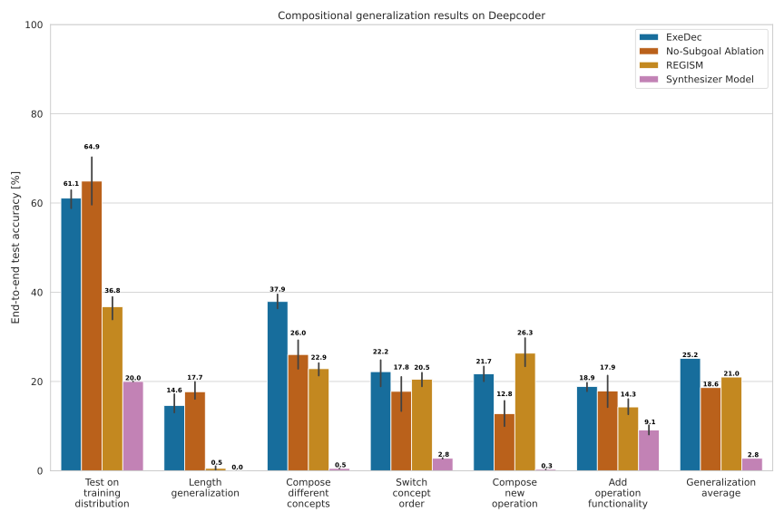
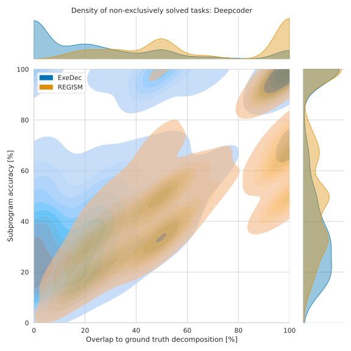

## Abstract

Task decomposition is a fundamental mechanism in program synthesis, enabling complex problems to be broken down into manageable subtasks. ExeDec, a state-of-the-art program synthesis framework, employs this approach by combining a Subgoal Model for decomposition and a Synthesizer Model for program generation to facilitate compositional generalization. In this work, we develop REGISM, an adaptation of ExeDec that removes decomposition guidance and relies solely on iterative execution-driven synthesis.

By comparing these two exemplary approaches—ExeDec, which leverages task decomposition, and REGISM, which does not—we investigate the interplay between task decomposition and program generation. Our findings indicate that ExeDec exhibits significant advantages in certain cases, likely due to its explicit decomposition strategies. At the same time, REGISM frequently matches or surpasses ExeDec’s performance across various scenarios, with its solutions often aligning more closely with ground truth decompositions.

These observations highlight the importance of repeated execution-guided synthesis in driving task-solving performance, even within frameworks that incorporate explicit decomposition strategies. Our analysis suggests that task decomposition approaches like ExeDec hold significant potential for advancing program synthesis, though further work is needed to clarify when and why these strategies are most effective.

[Read the full paper on arXiv](https://arxiv.org/abs/2503.08738)

---

## Introduction

Program synthesis aims to generate programs that satisfy a given specification, typically in the form of input-output examples. A key challenge in this field is **task decomposition**, where a complex synthesis problem is broken down into smaller, more manageable subtasks. Our motivation stems from the hypothesis that explicit decomposition can improve generalization by enabling models to construct solutions compositionally.

**ExeDec** follows this principle by incorporating a **Subgoal Model** that explicitly decomposes tasks into subtasks, alongside a **Synthesizer Model** that generates the corresponding programs. However, it remains unclear whether explicit decomposition is always beneficial or if an alternative approach—such as **iterative execution-driven synthesis**, where program generation is refined based on previous executions—can achieve similar or better results.

To explore this question, we introduce **REGISM**, a variant of ExeDec that eliminates explicit decomposition and relies purely on execution-driven synthesis. By comparing ExeDec and REGISM, we investigate the role of decomposition in program synthesis and examine whether explicit task decomposition is necessary for strong generalization or whether repeated execution alone can drive comparable or superior performance.

---

## Methods

To systematically evaluate the impact of explicit decomposition, we compare ExeDec and REGISM across two distinct program synthesis domains:

- **RobustFill:** A string manipulation synthesis benchmark where programs transform input strings into output strings based on input-output examples. Programs in this domain use operations such as substring extraction, concatenation, and character replacement. Effective synthesis in this domain requires recognizing and applying abstract string transformation patterns.

- **DeepCoder:** A functional program synthesis benchmark involving numerical and list-processing tasks. Programs in this domain perform operations such as sorting, filtering, and mapping over lists, as well as arithmetic computations. Success in DeepCoder depends on the model’s ability to compose learned functions and reason about numerical transformations.

We evaluate both methods on **out-of-distribution categories**, assessing their ability to synthesize programs that differ significantly from those encountered during training. By doing so, we aim to determine whether explicit task decomposition enhances generalization in these settings or whether iterative execution alone is sufficient to handle novel synthesis challenges.

---

## Results

Our findings reveal that ExeDec, with its explicit decomposition strategies, demonstrates advantages in certain settings, particularly in cases where structured subtask breakdowns provide useful inductive biases. However, REGISM often performs comparably or even surpasses ExeDec in various scenarios.

  

Notably, REGISM’s solutions frequently align more closely with the ground truth decompositions, suggesting that iterative execution-driven synthesis can naturally recover meaningful task structures without requiring explicit decomposition.

  

These results indicate that while task decomposition remains a powerful tool in program synthesis, execution-guided synthesis plays a crucial role in driving problem-solving performance. Our study highlights the need for further investigation into when and why explicit decomposition strategies are most beneficial and how they interact with execution-driven synthesis.

